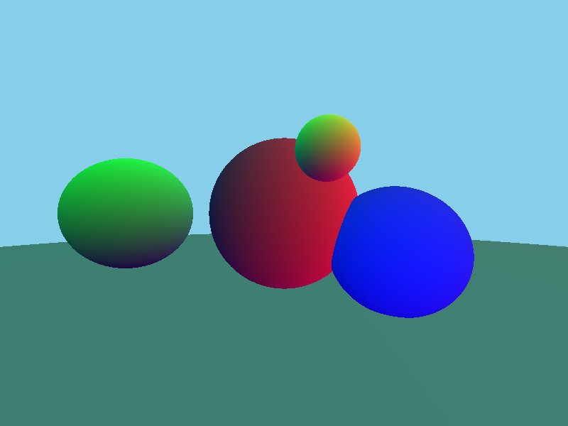
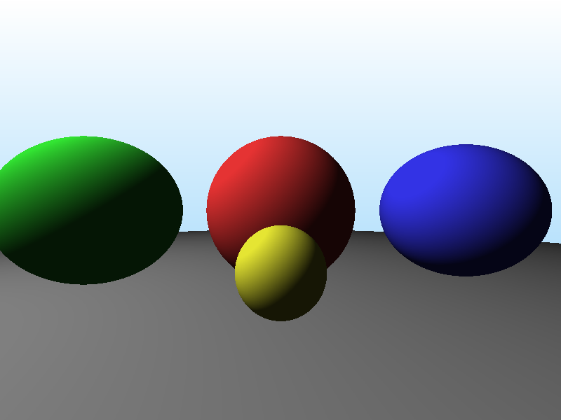
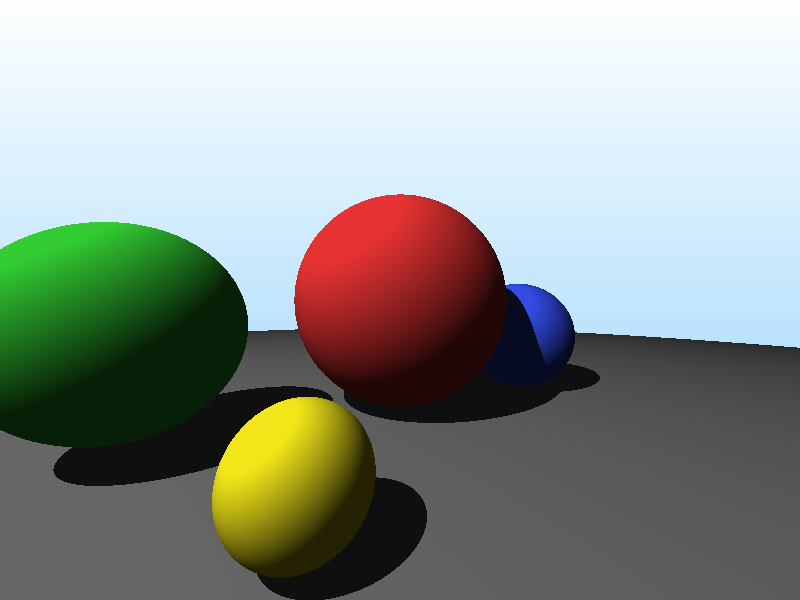
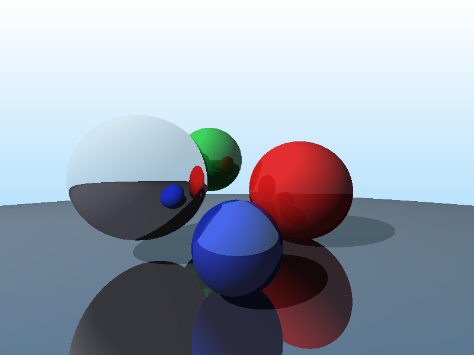

# datafusion-raytracer

A ray tracer where every pixel is a row in a DataFrame. Built entirely on [Apache DataFusion](https://datafusion.apache.org/).


## What is this?

This is a ray tracer that uses DataFusion's SQL engine and DataFrame API as its compute backend. There are no traditional rendering loops -- instead, the entire image is computed as a series of DataFrame transformations over a pixel grid.

Each pixel starts as a row with `(x, y)` coordinates, gets transformed through ray generation, intersection testing, lighting, shadows, reflections, and refraction -- all expressed as DataFrame operations. DataFusion's query optimizer and columnar Arrow execution engine handle the rest.

## Gallery

| Gradient | Sphere (SQL) | Sphere (DataFrame) |
|:---:|:---:|:---:|
|  |  |  |

| Multiple Spheres | Diffuse Lighting | Shadows |
|:---:|:---:|:---:|
|  |  |  |

| Reflections | Refraction (Glass) | Anti-Aliased |
|:---:|:---:|:---:|
|  |  |  |

## How It Works

The pipeline transforms a pixel grid through DataFrame operations:

```
generate_series(0..W) x generate_series(0..H)     Schema: (x, y)
        |
    pixels_to_rays()                               Schema: (x, y, ray_ox/oy/oz, ray_dx/dy/dz)
        |
    intersect_sphere() x N spheres                 Schema: + (t_sphere1, t_sphere2, ...)
        |
    find_nearest_hit()                             Schema: + (t_nearest, hit_sphere_idx)
        |
    compute_hit_point() + compute_normal()         Schema: + (hit_x/y/z, normal_x/y/z)
        |
    compute_shadow_ray() + shadow_intersections()  Schema: + (in_shadow)
        |
    compute_reflection_ray() + intersect()         Schema: + (reflect_hit_*, reflect_normal_*)
        |
    compute_lighting() + compute_final_color()     Schema: + (final_r, final_g, final_b)
        |
    SELECT x, y, r, g, b                          Schema: (x, y, r, g, b) → PPM file
```

Key insight: DataFusion doesn't care that it's rendering pixels. It just sees a wide table with ~480,000 rows being transformed through a chain of projections and expressions. The query optimizer fuses operations, and Arrow's columnar format enables SIMD-friendly execution.

### Query Plan (gradient scene)

Even the simplest scene produces a real physical query plan. Here's the `EXPLAIN ANALYZE` output for the gradient:

```
ProjectionExec: expr=[CAST(x AS UInt32) as x, CAST(y AS UInt32) as y,
                      CAST(x * 255 / 800 AS UInt32) as r,
                      CAST((x + y) * 128 / 1400 AS UInt32) as g,
                      CAST(255 - y * 127 / 600 AS UInt32) as b]
  metrics=[output_rows=480K, elapsed_compute=22ms]
  CrossJoinExec
    metrics=[output_rows=480K, build_input_rows=800, input_rows=600, join_time=5.7ms]
    LazyMemoryExec: generate_series(0, 799)   -- x coordinates
    RepartitionExec: RoundRobinBatch(10)
      LazyMemoryExec: generate_series(0, 599) -- y coordinates
```

DataFusion generates 800 x-values and 600 y-values, cross-joins them into 480,000 pixel rows, then computes all 5 output columns (x, y, r, g, b) in a single fused projection. The more complex scenes (reflections, refraction) produce plans with 100+ computed columns per row.

## Algorithm Progression

| Scene | Technique | What's New |
|-------|-----------|------------|
| `gradient` | Pure SQL | `generate_series` + arithmetic = pixel grid |
| `sphere` | SQL ray tracing | Quadratic formula for ray-sphere intersection |
| `dataframe_sphere` | DataFrame API | Same math, composable Rust functions |
| `multi_sphere` | Depth ordering | N spheres with nearest-hit selection |
| `lit_scene` | Lambertian shading | Point light + `dot(N, L)` diffuse |
| `shadows` | Shadow rays | Cast ray toward light, check for blockers |
| `reflections` | Mirror bounce | `R = I - 2(I·N)N`, blend by reflectivity |
| `refraction` | Snell's law | Two-bounce glass with Fresnel (Schlick) |
| `antialiased` | Multi-sample AA | 4 jittered rays/pixel, `AVG()` to smooth |

## DataFrame Pipeline

The core of the ray tracer is a chain of `DataFrame::with_column()` calls. Here's a taste:

```rust
// Generate pixel grid via SQL, then transform with DataFrame API
let df = ctx.sql("SELECT ... FROM generate_series(0, 799), generate_series(0, 599)").await?;

// Convert pixels to camera rays
let df = df.with_column("ray_dx", (col("x") / lit(800.0) - lit(0.5)) * lit(viewport_width))?;

// Ray-sphere intersection (quadratic formula)
let discriminant = half_b.clone() * half_b.clone() - a.clone() * c;
let t = case(discriminant.gt_eq(lit(0.0)))
    .when(lit(true), (lit(0.0) - half_b - sqrt(discriminant)) / a)
    .otherwise(lit(ScalarValue::Float64(None)))?;

// Lambertian diffuse: brightness = max(0, dot(N, L))
let n_dot_l = col("normal_x") * lx + col("normal_y") * ly + col("normal_z") * lz;
let diffuse = case(n_dot_l.clone().gt(lit(0.0)))
    .when(lit(true), n_dot_l * lit(light.intensity))
    .otherwise(lit(0.0))?;

// Anti-aliasing: average multiple samples per pixel
let df = df.aggregate(
    vec![col("pixel_x"), col("pixel_y")],
    vec![avg(col("sample_r")).alias("avg_r"), ...],
)?;
```

## Query Plan

Here's the actual `EXPLAIN ANALYZE` output for the `sphere` scene (800x600, single ray-sphere intersection). DataFusion compiles the entire render into a tree of `ProjectionExec` nodes over a `CrossJoinExec` of two `generate_series` calls:

```
ProjectionExec: expr=[CAST(x AS UInt32) as x, CAST(y AS UInt32) as y, r, g, b]              output_rows=480K  elapsed=28ms
  ProjectionExec: expr=[t IS NOT NULL AND t > 0, normal_x, normal_y, normal_z]              output_rows=480K  elapsed=15ms
    ProjectionExec: expr=[CASE WHEN disc >= 0 THEN (-half_b - sqrt(disc)) / a END as t]     output_rows=480K  elapsed=16ms
      ProjectionExec: expr=[half_b * half_b - a * c as disc, ...]                           output_rows=480K  elapsed=3ms
        ProjectionExec: expr=[dot(dir,dir) as a, dot(dir,oc) as half_b, |oc|²-r² as c]     output_rows=480K  elapsed=14ms
          ProjectionExec: expr=[viewport transform → ray origin + direction]                output_rows=480K  elapsed=11ms
            CrossJoinExec                                                                   output_rows=480K  elapsed=1.8ms
              LazyMemoryExec: generate_series(0, 799)                                       output_rows=800
              LazyMemoryExec: generate_series(0, 599)                                       output_rows=600
```

The full plan is a single pipeline with no shuffles or aggregations -- just a chain of columnar projections over 480,000 rows. DataFusion automatically extracts common sub-expressions (like the discriminant) into shared columns.

## Getting Started

```bash
git clone https://github.com/alexanderbianchi/datafusion-raytracer
cd datafusion-raytracer

# Render a specific scene
cargo run --release -- refraction

# Render all scenes
cargo run --release -- all

# View the output (macOS)
open refraction.ppm
```

Available scenes: `gradient`, `sphere`, `dataframe_sphere`, `multi_sphere`, `lit_scene`, `shadows`, `reflections`, `refraction`, `antialiased`, `all`

## Performance

Timings on Apple M-series (release build):

| Scene | Resolution | Time |
|-------|-----------|------|
| gradient | 800x600 | ~60ms |
| sphere | 800x600 | ~130ms |
| dataframe_sphere | 800x600 | ~90ms |
| multi_sphere | 800x600 | ~920ms |
| lit_scene | 800x600 | ~1.4s |
| shadows | 800x600 | ~1.4s |
| reflections | 800x600 | ~3.5s |
| refraction | 400x300 | ~5.6s |
| antialiased | 400x300 (4 spp) | ~260s |

Slower scenes have more DataFrame columns and deeper expression trees. The query plans are large -- `refraction` produces a plan with 100+ columns per row.
