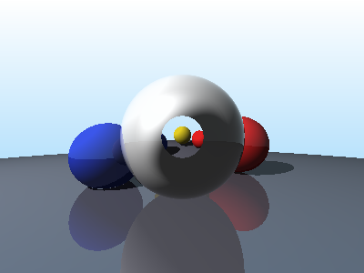
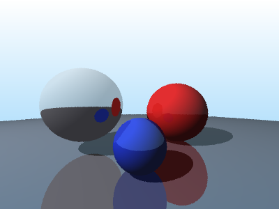

# datafusion-raytracer

A ray tracer built entirely on [Apache DataFusion](https://datafusion.apache.org/)'s DataFrame API and SQL engine. Every pixel is a row in a DataFrame -- no rendering loops, just query planning and columnar execution.



## What is this?

This project implements a progressively complex ray tracer where all computation happens inside DataFusion queries. Rays are columns. Pixels are rows. Intersections are `CASE WHEN` expressions. The entire rendering pipeline -- from generating pixel coordinates to computing Snell's law for glass refraction -- is expressed as DataFrame transformations that DataFusion optimizes and executes.

## Gallery

| Refraction (glass + Fresnel) | Anti-aliased (4 spp) |
|:---:|:---:|
|  |  |

## Algorithm Progression

Each scene builds on the previous one:

| Scene | What it adds | Technique |
|-------|-------------|-----------|
| `gradient` | Sky background | Pure SQL, `generate_series` cross join |
| `sphere` | Single sphere | Ray-sphere intersection via quadratic formula in SQL |
| `dataframe_sphere` | Same sphere, DataFrame API | `df.with_column()` pipeline instead of raw SQL |
| `multi_sphere` | Multiple spheres + depth | Nearest-hit selection across N spheres |
| `lit_scene` | Diffuse lighting | Lambertian shading: `max(0, dot(N, L))` |
| `shadows` | Shadow rays | Secondary ray cast toward light source |
| `reflections` | Mirror reflections | `R = I - 2(I·N)N`, single-bounce reflected rays |
| `refraction` | Glass spheres | Snell's law, Fresnel (Schlick), total internal reflection |
| `antialiased` | Anti-aliasing | Multiple jittered samples per pixel, `AVG()` aggregation |

## How it Works

The rendering pipeline is a chain of DataFrame transformations:

```
generate_series(pixels) × generate_series(pixels)
  → pixel_grid (x, y)
  → pixels_to_rays (origin, direction)
  → intersect_sphere (t values per sphere)
  → find_nearest_hit (min t)
  → compute_normal (surface orientation)
  → compute_lighting (diffuse + shadow rays)
  → compute_reflections (reflected ray → recurse)
  → to_pixel_output (cast to UInt32 RGB)
  → write_ppm (collect batches → image file)
```

Each step adds columns to the DataFrame. DataFusion optimizes the entire plan and executes it in parallel across batches.

## Getting Started

```bash
git clone https://github.com/alexanderbianchi/datafusion-raytracer.git
cd datafusion-raytracer

# Render a single scene
cargo run --release -- refraction

# Render all scenes
cargo run --release -- all

# Available scenes:
# gradient, sphere, dataframe_sphere, multi_sphere,
# lit_scene, shadows, reflections, refraction, antialiased
```

Output images are written as `.ppm` files in the current directory. View them with Preview (macOS), `feh`, or convert with ImageMagick:

```bash
convert refraction.ppm refraction.png
```
